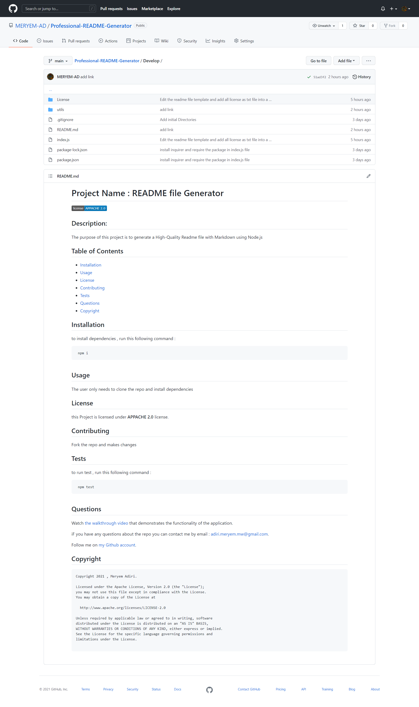

# Professional-README-Generator

 Creation of a repository in GitHub:

  * Name of repository: Professional README Generator

# Starting to Apply the Acceptance Criteria.

 * The Application starts with a set of questions about the application repository as title of the project and sections entitled Description, Table of Contents, Installation, Usage, License, Contributing, Tests, and Questions;
 * When the user enters the project title then this is displayed as the title of the README;
 * When the user enters a description, installation instructions, usage information, contribution guidelines, and test instructions then this information is added to the sections of the README entitled Description, Installation, Usage, Contributing, and Tests;
 * When the user chooses a license for his application from a list of options then a badge for that license is added near the top of the README and a notice is added to the section of the README entitled License that explains which license the application is covered under;
 * When the user enters his GitHub username then this is added to the section of the README entitled Questions, with a link to his GitHub profile;
 * When the user enters his email address then this is added to the section of the README entitled Questions, with instructions on how to reach him with additional questions;
 * When the user click on the links in the Table of Contents then his is taken to the corresponding section of the README.

# Extra developing code :

* I have embend the copyright license into the generated ReadMe file instead of return a link and redirect the user to a webpage to read the license used by working with  **File System Module**
.
# GitBash & GitHub:

* Commit with msg every modification in code.
* Pushing to the repository in GitHub. 

# Application's Screenshots :

* Simple of a README.md file generated using the application:

# Links :

* walkthrough video link : https://drive.google.com/file/d/1jkXtyGPJbIWC_NdDINtnr0y9qOfhhUgB/view

* The URL of README.md file generated using the application in Github repository : https://github.com/MERYEM-AD/Professional-README-Generator/blob/main/Develop/README.md

* The URL of the GitHub repository: https://github.com/MERYEM-AD/Professional-README-Generator
